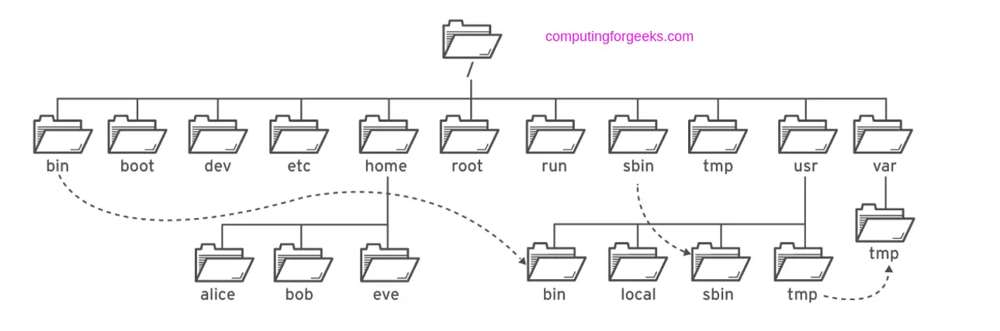

# File Systems
Here, you will learn the fundamentals of your Linux filesystem.

[Beginner Tasks](/File%20Systems/Beginner/REAdME.md)

[Intermediate Tasks](/File%20Systems/Intermediate/)

[Advanced Task](/File%20Systems/Advanced/)